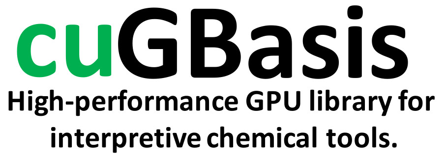

## About
CuGBasis is a free, and open-source C++/CUDA and Python library for computing various quantities efficiently 
using NVIDIA GPU's in quantum chemistry. It is highly-optimized and vectorized, making it useful for cases
where efficiency matters.

CuGBasis can read various wave-function formats (wfn, wfx, molden and fchk) using IOData and supports up-to g-type orbitals. 
Please see the website for more information.

To report any issues or ask questions, either [open an issue](
https://github.com/theochem/cuGBasis/issues/new) or email [qcdevs@gmail.com]().

See the website for more information: [cuGBasis](https://cugbasis.qcdevs.org)

## Citation
Please use the following citation in any publication:
> **"CuGBasis: High performance CUDA/Python Library For Efficient Computation
> of Quantum Chemistry Density-Based Descriptors for Larger Systems."**,
> A. Tehrani, M. Richer, F. Heidar‐Zadeh
>
